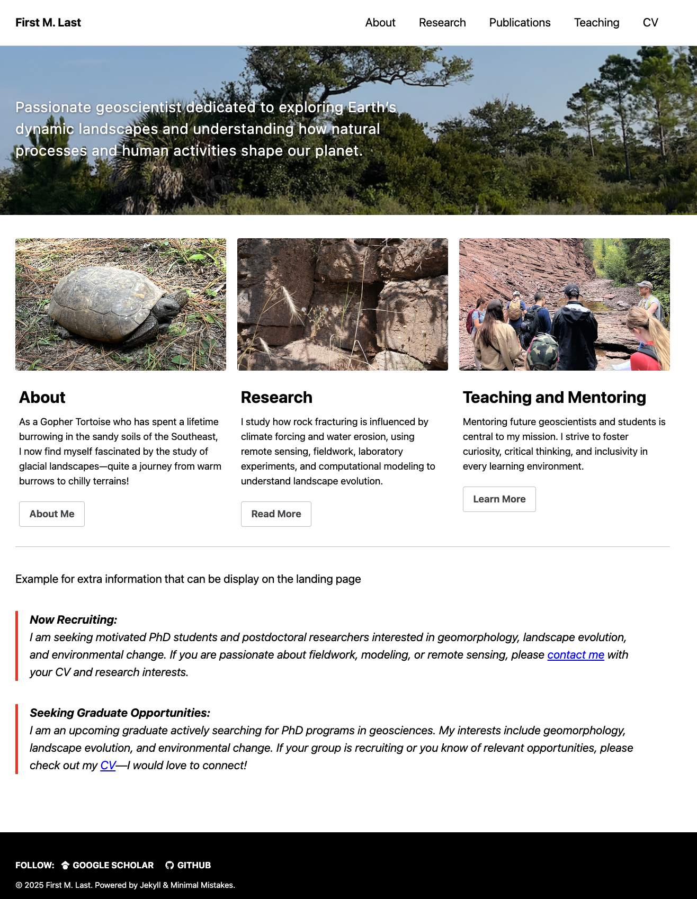
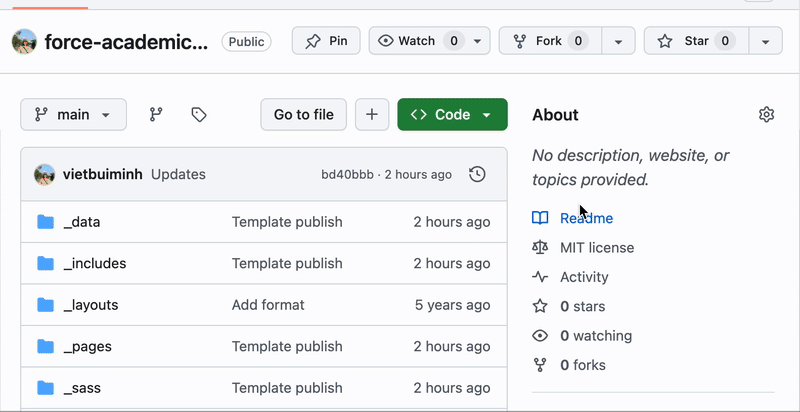
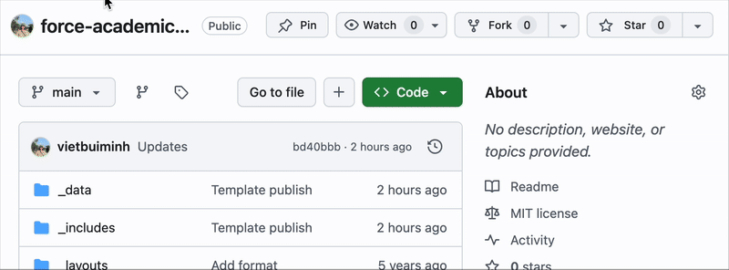

# Getting Started

## Demo

Follow these steps to set up your own website using this template:

## 1. Fork the Repository

- Go to the [force-academic-mk repository page](https://github.com/vietbuiminh/force-academic-mk).
- Click **Fork** at the top right.
- Name your new repository as `yourusername.github.io`.

## 2. Edit Configuration

- In your forked repository, locate the `config.yml` file.
- Update the settings as needed (e.g., site title, description, author).

## 3. Create the `gh-pages` Branch

- Go to the **Code** tab.
- Click **Branch: main** and type `gh-pages` to create a new branch.
- Switch to the `gh-pages` branch.

## 4. Enable GitHub Pages

- Go to **Settings** > **Pages**.
- Under **Source**, select the `gh-pages` branch.
- Click **Save**.

Your site will be published at `https://yourusername.github.io` shortly.